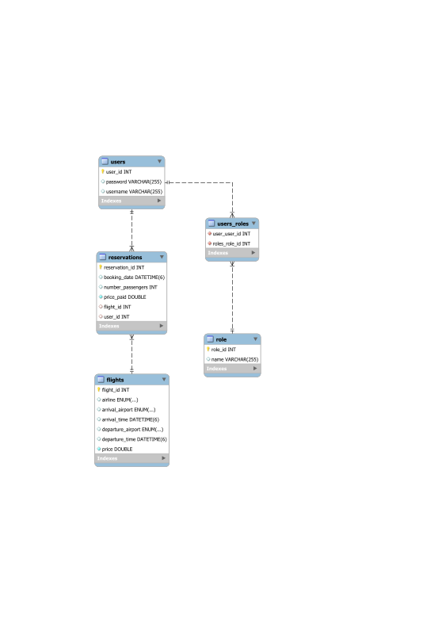

## Flight Management
This project implements a robust and secure Flight Management System (FMS) as a RESTful API, catering to both users and administrators. It empowers users with functionalities to search and reserve flights, while equipping administrators with extensive control over flight management, reservations, and user accounts.

### Class Diagram

### Setup

#### Pre-requisites
 - Java 17 or later.
 - MySQL Database
 - Postman or similar programs

#### Instructions
 - Clone the project.
 - Configure the database name, user and password by replacing the local variables or creating them on the application.properties file.
 -  Run your project.
 - Use postman or similar programs to make the requests to the API endpoints. 

 ### Routes
 For a more detailed explanation of each route go to this link:
 http://localhost:8080/swagger-ui/index.html#/

 ### Extra Links
 -Presentation: https://docs.google.com/presentation/d/1Is8P3Zox3ELRgjChDnGxDy6nTtcz9UD4vffJuLY1tYA/edit?usp=sharing
 -Task Manager: https://github.com/users/victoriaschwin/projects/2

 ### Future Work
 Add new features to handle stepovers in flights and more complex flight searches.

